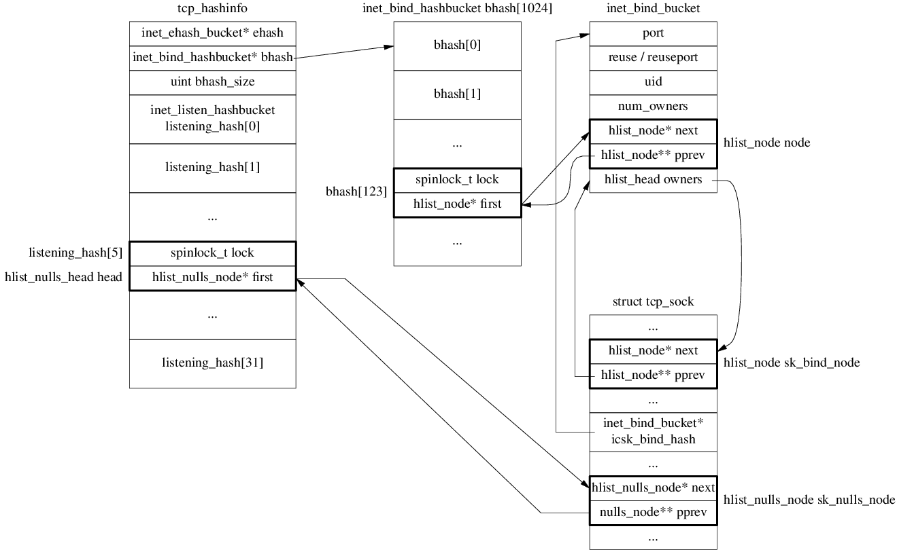

# bind
```
sys_bind
  -> inet_bind
    -> inet_csk_get_port
      -> goto have_snum:
      -> goto tb_not_found:  tb == NULL
        -> inet_bind_bucket_create
      -> goto success:
        -> inet_bind_hash
          -> sk_add_bind_node
  -> fput_light
```

# listen
```
sys_listen
  -> inet_listen
    -> inet_csk_listen_start
      -> reqsk_queue_alloc
      -> inet_csk_delack_init
      -> set sk->sk_state = TCP_LISTEN
      -> inet_csk_get_port
        -> goto have_snum:
        -> goto tb_found:
          -> inet_csk_bind_conflict
        -> goto tb_not_found:  tb != NULL
      -> inet_hash
        -> __inet_hash  // tcp_hashinfo.listening_hash[X] add node
```



# Passive open

## Receive SYN
```
tcp_v4_rcv
  -> __inet_lookup_skb
    -> __inet_lookup
      -> __inet_lookup_established
      -> __inet_lookup_listener  // found

  -> tcp_v4_do_rcv  // sk_state == TCP_LISTEN
    -> tcp_rcv_state_process
      -> tcp_v4_conn_request  // icsk->icsk_af_ops->conn_request
        -> tcp_conn_request
          -> req = inet_reqsk_alloc
            -> reqsk_alloc
               req->rsk_listener = sk_listener;
            ireq->ireq_state = TCP_NEW_SYN_RECV;
          -> tcp_parse_options
          -> tcp_openreq_init
          -> tcp_v4_init_req  // af_ops->init_req
            -> tcp_v4_save_options
          -> tcp_v4_init_sequence  // af_ops->init_seq
          -> tcp_v4_route_req  // af_ops->route_req
            -> inet_csk_route_req
              -> flowi4_init_output
              -> ip_route_output_flow
          -> tcp_ecn_create_request
          -> tcp_reqsk_record_syn
          -> inet_csk_reqsk_queue_hash_add
            -> reqsk_queue_hash_req
              -> inet_ehash_insert
                -> __sk_nulls_add_node_rcu
            -> inet_csk_reqsk_queue_added
          -> tcp_v4_send_synack  // af_ops->send_synack
            -> tcp_make_synack
            -> __tcp_v4_send_check
            -> ip_build_and_send_pkt
              -> ip_local_out
                -> __ip_local_out
                  -> dst_output
                    -> ip_output
```

## Receive ACK
```
tcp_v4_rcv
  -> __inet_lookup_skb
    -> __inet_lookup
      -> __inet_lookup_established  // found
  -> sk->sk_state == TCP_NEW_SYN_RECV
  -> tcp_check_req
    -> tcp_parse_options
      -> tcp_paws_reject
      -> tcp_in_window
    -> tcp_v4_syn_recv_sock  // inet_csk(sk)->icsk_af_ops->syn_recv_sock
      -> tcp_create_openreq_child
        -> inet_csk_clone_lock
          -> sk_clone_lock
            -> sk_prot_alloc
        -> tcp_init_xmit_timers
      -> inet_sk_rx_dst_set
      -> inet_csk_route_child_sock
      -> tcp_ca_openreq_child
        -> tcp_assign_congestion_control
        -> tcp_set_ca_state TCP_CA_Open
          -> bictcp_state
      -> tcp_sync_mss -> dst_mtu -> ipv4_mtu
        -> tcp_mtu_to_mss
        -> tcp_bound_to_half_wnd
      -> dst_metric_advmss -> ipv4_default_advmss
      -> tcp_initialize_rcv_mss
      -> __inet_inherit_port -> inet_bind_hash
      -> inet_ehash_nolisten
        -> inet_ehash_insert
          -> sk_nulls_del_node_init_rcu
          -> __sk_nulls_add_node_rcu
        -> sock_prot_inuse_add
      -> tcp_move_syn
    -> sock_rps_save_rxhash
    -> tcp_synack_rtt_meas
      -> skb_mstamp_us_delta
      -> tcp_ack_update_rtt
        -> tcp_update_rtt_min
        -> tcp_rtt_estimator
        -> tcp_set_rto
    -> inet_csk_complete_hashdance
      -> inet_csk_reqsk_queue_drop
      -> reqsk_queue_removed
      -> inet_csk_reqsk_queue_add
        -> sk_acceptq_added
  -> tcp_child_process
    -> tcp_rcv_state_process
      -> tcp_validate_incoming
      -> tcp_ack
        -> tcp_ack_update_window
        -> tcp_ecn_rcv_ecn_echo  // false
        -> tcp_in_ack_event
        return 1
      -> sk_state == TCP_SYN_RECV
      -> inet_sk_rebuild_header  // icsk->icsk_af_ops->rebuild_header
      -> tcp_init_congestion_control -> bictcp_init
      -> tcp_mtup_init
      -> tcp_init_buffer_space
        -> tcp_fixup_rcvbuf
        -> tcp_sndbuf_expand
        -> tcp_full_space
      TCP_ESTABLISHED
      sk->sk_state_change -> sock_def_wakeup
      -> tcp_init_metrics
      -> tcp_update_pacing_rate
      -> tcp_initialize_rcv_mss
      -> tcp_fast_path_on
      // out of switch
      -> tcp_urg
      // switch TCP_ESTABLISHED
      -> tcp_data_queue
      -> tcp_data_snd_check
      -> tcp_ack_snd_check
    -> parent->sk_data_ready -> sock_def_readable -> wake_up_interruptible_sync_poll
```

# connect

# tcp_v4_rcv

# read

# write
