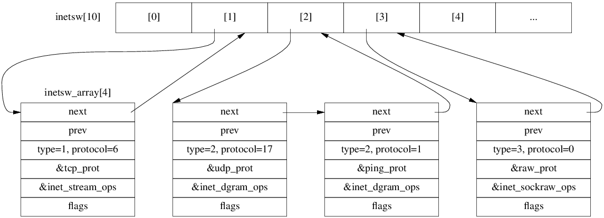

| family | type | protocol |
| --- | --- | --- |
| AF_UNIX=1 | SOCK_STREAM=1 | 0
| AF_UNIX | SOCK_DGRAM=2 | 0
| AF_INET=2 | SOCK_STREAM | IPPROTO_TCP=6 |
| AF_INET | SOCK_DGRAM | IPPROTO_UDP=17 |
| AF_INET | SOCK_DGRAM | IPPROTO_ICMP=1 |
| AF_INET | SOCK_RAW=3 | IPPROTO_IP=0 |
| NPROTO=AF_MAX=41 | SOCK_MAX=11 | no max?|

# net_proto_family

```c
// include/linux/net.h
// How to create a socket for an address family
struct net_proto_family {
  int family;  // AF_INET, AF_UNIX, AF_INET6, etc. must: 0 <= family < NPROTO
  int (*create)(struct net *net, struct socket *sock, int protocol, int kern);
  struct module *owner;
};

```


```c
// net/socket.c
static const struct net_proto_family *net_families[NPROTO];

// net/ipv4/af_inet.c
static int inet_create(struct net *net, struct socket *sock, int protocol, int kern);

static const struct net_proto_family inet_family_ops = {
  .family = PF_INET,
  .create = inet_create,
  .owner  = THIS_MODULE
};

// inet_init() calls sock_register():
net_families[AF_INET] = &inet_family_ops;
```

```
int sys_socket(int family, int type, int protocol)
  -> struct socket* sock_create(family, type, protocol)
    -> __sock_create(family, type, protocol)
      -> struct socket* sock = sock_alloc()
        -> new_inode_pseudo(super_block of sockfs)      // fs/inode.c
      -> net_families[family]->create(sock, protocol)
        -> inet_create(sock, protocol)                  // net/ipv4/af_inet.c

inet_create(sock, protocol)
  -> find inet_protosw for sock->type & protocol
  -> struct sock* sk = sk_alloc()
    -> sk_prot_alloc -> kmem_cache_alloc (tcp_prot is 1296B)
  -> sock_init_data
  -> sk->sk_prot->init(sk)
    -> tcp_v4_init_sock
```

# inet_protosw

```c
// include/net/protocol.h
/* This is used to register socket interfaces for IP protocols.  */
struct inet_protosw {
  struct list_head list;

  /* These two fields form the lookup key.  */
  unsigned short   type;     /* This is the 2nd argument to socket(2).  eg. SOCK_STREAM, SOCK_DGRAM */
  unsigned short   protocol; /* This is the L4 protocol number.  eg. IPPROTO_TCP, IPPROTO_TCP */

  struct proto           *prot;
  const struct proto_ops *ops;
  
  unsigned char    flags;      /* See INET_PROTOSW_* below.  */
};
#define INET_PROTOSW_REUSE      0x01  /* Are ports automatically reusable? */
#define INET_PROTOSW_PERMANENT  0x02  /* Permanent protocols are unremovable. */
#define INET_PROTOSW_ICSK       0x04  /* Is this an inet_connection_sock? */
```

```c
// net/ipv4/af_inet.c
/* The inetsw table contains everything that inet_create needs to
 * build a new socket.
 */
static struct list_head inetsw[SOCK_MAX];
static DEFINE_SPINLOCK(inetsw_lock);

/* Upon startup we insert all the elements in inetsw_array[] into
 * the linked list inetsw.
 */
static struct inet_protosw inetsw_array[] =
{
  {
    .type =       SOCK_STREAM,
    .protocol =   IPPROTO_TCP,
    .prot =       &tcp_prot,
    .ops =        &inet_stream_ops,
    .flags =      INET_PROTOSW_PERMANENT | INET_PROTOSW_ICSK,
  },
  {
    .type =       SOCK_DGRAM,
    .protocol =   IPPROTO_UDP,
    .prot =       &udp_prot,
    .ops =        &inet_dgram_ops,
    .flags =      INET_PROTOSW_PERMANENT,
  },
  {
    .type =       SOCK_DGRAM,
    .protocol =   IPPROTO_ICMP,
    .prot =       &ping_prot,
    .ops =        &inet_dgram_ops,
    .flags =      INET_PROTOSW_REUSE,
  },
  {
    .type =       SOCK_RAW,
    .protocol =   IPPROTO_IP,        /* wild card */
    .prot =       &raw_prot,
    .ops =        &inet_sockraw_ops,
    .flags =      INET_PROTOSW_REUSE,
  }
};

#define INETSW_ARRAY_LEN ARRAY_SIZE(inetsw_array)

// inet_init()
  sock_register(&inet_family_ops);

  /* Register the socket-side information for inet_create. */
  for (struct list_head *r = &inetsw[0]; r < &inetsw[SOCK_MAX]; ++r)
    INIT_LIST_HEAD(r);

  for (struct inet_protosw *q = inetsw_array; q < &inetsw_array[INETSW_ARRAY_LEN]; ++q)
    inet_register_protosw(q);
```

After Initialization:

